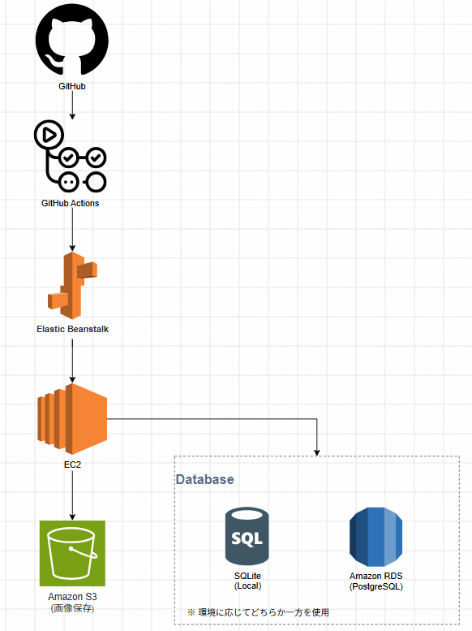

# 漫画感想アプリ（Flask）

## 開発目的

Flaskを用いたWebアプリケーション開発の学習に加え、AWSを利用したインフラ構築やCI/CDの実践を目的として開発しました。

CRUD機能だけでなく、Amazon S3による画像保存、Amazon RDSとの接続、GitHub Actionsによる自動デプロイなど、実際のWebサービス開発を意識した構成を目指しました。

---

## 概要

好きな漫画に対して感想や評価を投稿・共有できるWebアプリケーションです。

PythonのWebフレームワーク「Flask」を使用し、ユーザー登録・ログイン、投稿、いいね、コメント、プロフィール、ランキング、検索など、SNS型Webアプリケーションの基本機能を実装しています。

また、AWSへデプロイし、GitHub ActionsによるCI/CD環境も構築しています。

---

## 主な機能

- ユーザー登録 / ログイン
- 投稿機能（タイトル・感想・評価）
- 投稿の編集 / 削除
- 投稿一覧表示
- いいね機能
- コメント機能
- プロフィール機能
  - 表示名
  - 自己紹介
  - プロフィール画像
- ランキング機能
  - いいね数
  - 評価順
- タイトル・感想検索
- Google Books APIを利用した漫画検索（実装途中）

---

## 使用技術

### バックエンド

- Python 3.11
- Flask
- Flask-Login
- Flask-SQLAlchemy
- Flask-Migrate
- Gunicorn

### フロントエンド

- HTML
- CSS
- Jinja2

### データベース

- SQLite
- Amazon RDS PostgreSQL

### AWS

- AWS Elastic Beanstalk
- Amazon EC2
- Amazon S3
- Amazon RDS
- IAM

### CI/CD

- GitHub Actions
- GitHub OIDC

### その他

- Google Books API
- Git
- GitHub

---

## システム構成



---

## CI/CD

GitHub Actionsを利用し、mainブランチへPushすると自動でElastic BeanstalkへデプロイされるCI/CD環境を構築しています。

AWS認証にはGitHub OIDCを利用し、アクセスキーを使用しないセキュアな認証方式を採用しています。

### デプロイフロー

```text
git push
    │
    ▼
GitHub Actions
    │
    ▼
GitHub OIDC認証
    │
    ▼
AWS Elastic Beanstalkへ自動デプロイ
```

---

## 工夫した点

- Flask Blueprintを利用し、機能ごとにコードを分割
- SQLAlchemyを利用したORM設計
- Amazon S3へ画像を保存し、ローカルストレージへ依存しない構成
- 環境変数(DATABASE_URL)によってSQLiteとAmazon RDS PostgreSQLを切り替えられる構成
- GitHub ActionsによるCI/CD環境を構築
- GitHub OIDC認証を利用し、AWSアクセスキーを使用しないセキュアなデプロイを実現

---

## 画面イメージ

※ スクリーンショットを後日追加予定

---

## インストール方法

リポジトリをクローンします。

```bash
git clone https://github.com/toru1064/manga_project.git
cd manga_project/manga_app
```

仮想環境を作成します。

```bash
python -m venv venv
```

Windows

```bash
venv\Scripts\activate
```

ライブラリをインストールします。

```bash
pip install -r requirements.txt
```

環境変数を設定します。

```env
SECRET_KEY=xxxx
DATABASE_URL=xxxx（未設定の場合はSQLiteを使用）
GOOGLE_BOOKS_API_KEY=xxxx
S3_BUCKET_NAME=xxxx
```

アプリを起動します。

```bash
flask run
```

---

## 今後の改善予定

- Google Books APIの検索結果を投稿フォームへ自動反映
- 投稿時に表紙画像・著者情報を自動取得
- 画像の圧縮・リサイズ対応
- Docker対応
- CloudFrontを利用した画像配信
- レスポンシブデザインの改善